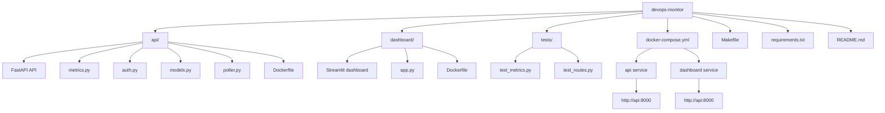
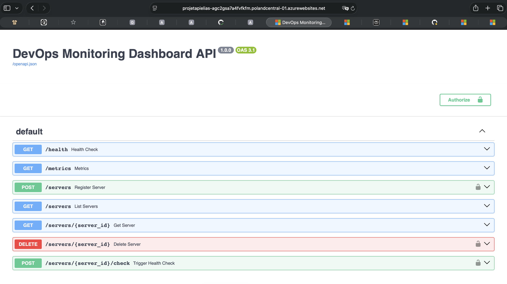
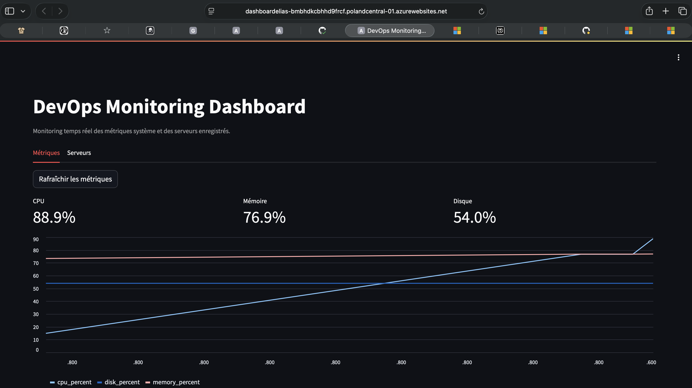

# DevOps Monitoring Dashboard

Projet final du cours Python for DevOps : une API FastAPI de monitoring, un dashboard Streamlit, des tests automatisés et un environnement local reproductible avec Docker Compose.

Déploiement actuel : l'application est hébergée sur Azure Web App et accessible ici : https://projetapielias-agc2gsa7a4fvfkfm.polandcentral-01.azurewebsites.net

## Architecture



- `api/` : backend FastAPI avec routes `/health`, `/metrics`, `/servers` et WebSocket `/ws/metrics`
- `dashboard/` : interface Streamlit, déployée comme webapp
- `tests/` : tests unitaires et tests de routes
- `docker-compose.yml` : exécution locale de la stack

## Captures

### API



### Dashboard



## Prérequis

- Python 3.11
- Docker et Docker Compose
- Make

## Installation locale

```bash
cp .env.example .env
make up
make test
```

## Variables d'environnement

- `API_KEY` : clé utilisée par l'API pour protéger les actions sensibles
- `API_BASE_URL` : URL de l'API utilisée par le dashboard, par défaut `http://api:8000`
- `AZURE_CLIENT_ID`, `AZURE_CLIENT_SECRET`, `AZURE_TENANT_ID` : non requis par l'application actuelle

## Déploiement Azure

Le projet est déployé sur Azure Web App avec deux applications séparées:

- API: [main_projetapielias.yml](.github/workflows/main_projetapielias.yml)
- Dashboard: [main_dashboardelias.yml](.github/workflows/main_dashboardelias.yml)

Le lien public fourni pour l'application est: https://projetapielias-agc2gsa7a4fvfkfm.polandcentral-01.azurewebsites.net

Les deux autres workflows sont conservés comme base de migration vers AKS:

- [dashboardelias.yml](.github/workflows/dashboardelias.yml)
- [ci-cd.yml](.github/workflows/ci-cd.yml)

Ils ne correspondent pas au chemin de production actuel.

Les variables de déploiement Azure Web App sont gérées dans les workflows GitHub Actions via les secrets Azure App Service déjà configurés. Le dépôt conserve aussi les anciens éléments d'infrastructure Container Apps pour mémoire, mais ils ne pilotent plus le déploiement courant.

## Conformité au Projet_Proposal

Hors partie Azure, le projet répond aux exigences du cahier des charges:

- API FastAPI avec `GET /health`, `GET /metrics`, `POST /servers`, `GET /servers`, `GET /servers/{id}`, `DELETE /servers/{id}`, `POST /servers/{id}/check` et `WS /ws/metrics`
- métriques système via `psutil` avec CPU, mémoire et disque
- authentification par clé API sur les opérations sensibles
- modèle `Server` avec schémas d'entrée et de sortie Pydantic
- boucle de polling asynchrone pour mettre à jour l'état des serveurs
- dashboard Streamlit avec onglets métriques et serveurs
- cache, métriques, graphique live et tableau coloré côté dashboard
- Docker, Docker Compose et Makefile pour l'exécution locale
- tests automatisés avec couverture minimale visée à 75 %

Les exigences Azure du document d'origine portaient sur Container Apps et ACR; l'implémentation courante du dépôt a été adaptée à Azure Web App pour l'hébergement réel.

## Lancement local sans Docker

```bash
source .venv/bin/activate
make dev
```

## Endpoints

- `GET /health`
- `GET /metrics`
- `POST /servers`
- `GET /servers`
- `GET /servers/{id}`
- `DELETE /servers/{id}`
- `POST /servers/{id}/check`
- `WS /ws/metrics`

## Notes

Le dépôt reste orienté pour une lecture rapide du projet et pour une migration éventuelle vers AKS si besoin.
